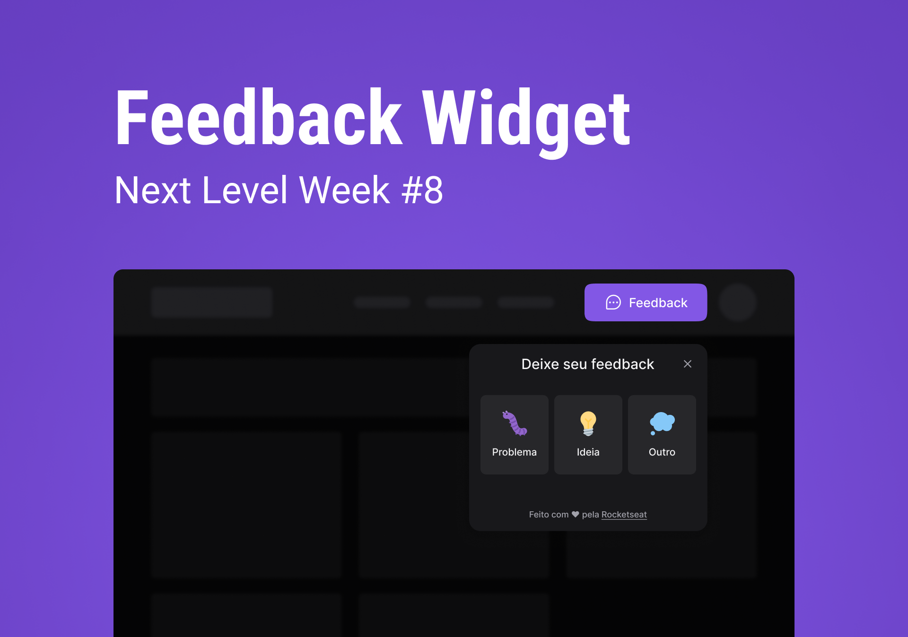

<h1 align="center">Feedget</h1>

  

## Project

Feedget is a widget that can be inserted in websites and mobile apps to collect users feedback. First the user select a category to your feedback, then he must write about your feedback. The user can chose take or not a screenshot to send together with feedback. One email is send to adminstrator with the eedback.

## Features

- Keyboard navigation (Accessibility);
- Screenshot;
- Use REST API;
- Send email with [Mailtrap](https://mailtrap.io/);

## Technologies and Libraries

General:

- [Node.JS v16.13.0](https://nodejs.org/en/)
- [NPM 8.1.0](https://www.npmjs.com/)
- [Visual Studio Code 1.62.0](https://code.visualstudio.com/)

Web application with React JS and TypeScript:

- [Vite](https://vitejs.dev/#overview)
- [Tailwindcss](https://tailwindcss.com/)
- [Headlessui](https://headlessui.dev/)
- [Phosphor Icons](https://github.com/phosphor-icons/phosphor-home)
- [html2canvas](https://www.npmjs.com/package/html2canvas)
- [axios](https://www.npmjs.com/package/axios)
- [Vercel](https://vercel.com)

Server with Node.JS and TypeScript:

- Express
- Prisma
- Jest
- Cors
- [Railway](https://railway.app/)

Mobile application with Expo and TypeScript:

- Expo 5.0.3
- [Phosphor Icons](https://github.com/phosphor-icons/phosphor-home)
- [axios](https://www.npmjs.com/package/axios)
- [Bottom Sheet](https://gorhom.github.io/react-native-bottom-sheet/)

## Mobile devices used in mobile application development

- Android (Physical): API 27
- Android (Emulator): API 30

## Layout

You can view the project layout through this [link](https://www.figma.com/file/mYP7d7JXYMI7uyOuZe8s8c/Feedback-Widget-(Community)?node-id=100%3A2114). Figma account is required to access it.

## Database

  

## How to run

- Clone the repository;
- Access repository folder;

### Server
- Access server folder;
- Install dependencies with `npm install`;
- Change provider 'postgresl' to 'sqlite' in the file server_nodejs\prisma\schema.prisma;
- Change provider 'postgresl' to 'sqlite' in the file server_nodejs\prisma\migrations\migration_lock.toml;
- Create file `.env` in the directory server_nodejs\;
- Insert `DATABASE_URL="file:./dev.db"` in the file server_nodejs\.env;
- Run command `npx prisma migrate dev` to execute migrations;
- Run command `npm run dev` to start server;

### Web
- Access web folder;
- Install dependencies with `npm install`;
- Create file web_react\.env.local; 
- Add `VITE_API_URL=http://your machine's ip:3333` in the file web_react\.env.local;
- Run command `npm run dev` to start application;

### Mobile
- Access mobile folder;
- Install dependencies with `npm install`;
- Change the value of the `baseURL` parameter to `http://your machine's ip:3333` in the file mobile_reactnative\src\libs\api.ts; 
- Start the expo with `expo start`, `yarn start` or `npm start`;
- To execute mobile aplication in the a physical cellphone install Expo Go or use a emulator;

## License

This project is under the MIT license. See the [LICENSE](LICENSE.md) file for more details.